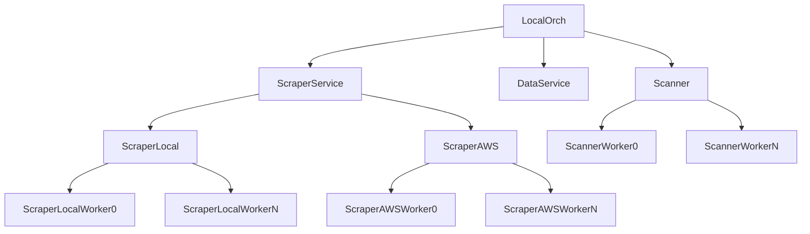

# dspm-scanner

## Architecture



### Scraper
Scrapes metadata from:
- AWS S3 buckets
- Local disk

### DataStore
Data service, backed by:
- SQLite

### Scanner
Scan assets described by metadata.

## Build & Test
```bash
goreleaser release --snapshot --clean

go test -v ./...
```
